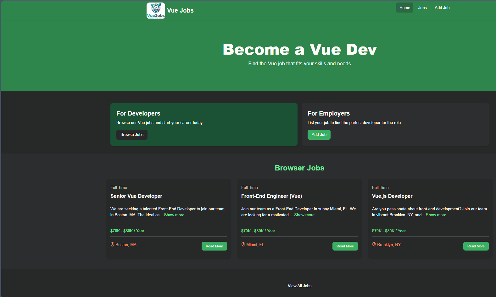

# Vue Jobs — Job Listings App

A small Vue 3 single-page application that lists developer jobs, allows adding, editing, and viewing job details. Built with Vite and Tailwind CSS — a learning project following Traversy Media's tutorial.

## Features

- Browse job listings
- View job details
- Add new jobs
- Edit existing jobs
- Client-side routing with Vue Router

## Tech Stack

- Vue 3
- Vite
- Tailwind CSS
- JavaScript (ES modules)

## Project Structure

- `src/` — source files
- `src/components/` — Vue components
- `src/views/` — route views
- `jobs.json`, `jobs2.json` — sample data
- `screenshots/` — UI screenshots

## Screenshots

Replace the filenames below with the actual images in the `screenshots/` folder if they differ.

Home view


Job listings


Add job form


Edit job view


## Getting Started

1. Install dependencies:

```
npm install
```

2. Run the dev server:

```
npm run dev
```

3. Open the app at the URL shown in the terminal (`http://localhost:3000`).

## Notes

- This project uses local JSON files (`jobs.json`, `jobs2.json`) for data; no backend is included.
- Screenshots live in the `screenshots/` folder. Add or replace images there and update names in this README if necessary.

## License

This repository is provided for learning purposes. Feel free to use and adapt the code.

# Vue 3 + Vite

This template should help get you started developing with Vue 3 in Vite. The template uses Vue 3 `<script setup>` SFCs, check out the [script setup docs](https://v3.vuejs.org/api/sfc-script-setup.html#sfc-script-setup) to learn more.

Learn more about IDE Support for Vue in the [Vue Docs Scaling up Guide](https://vuejs.org/guide/scaling-up/tooling.html#ide-support).
